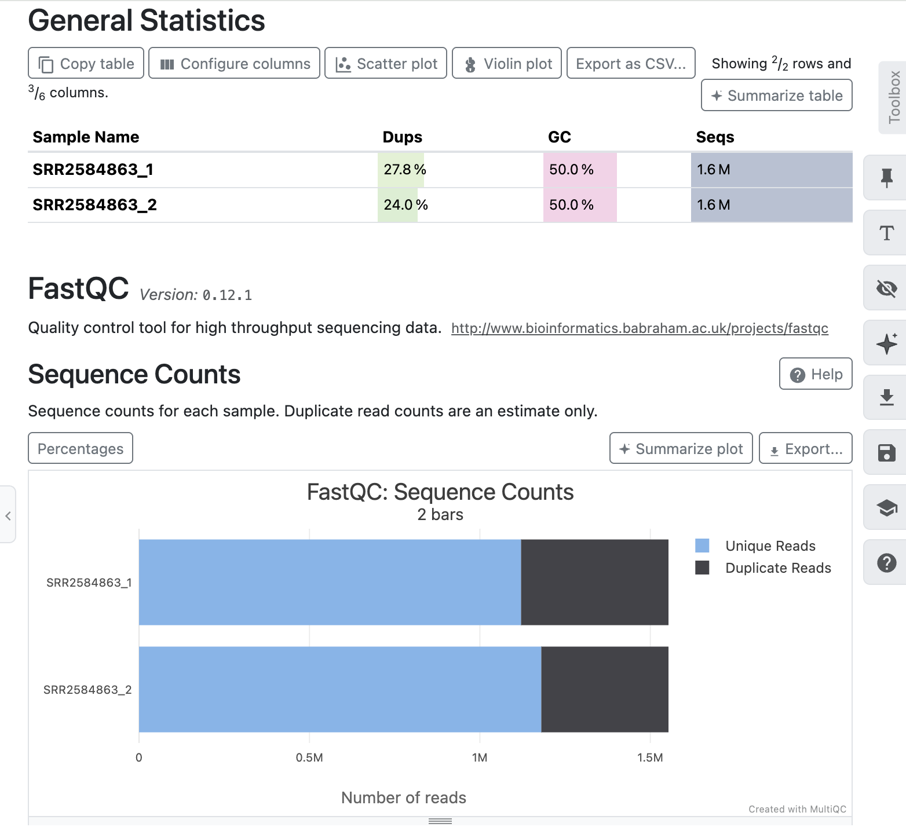

# NGS-Variant-Calling-Pipeline
End-to-end Illumina NGS variant calling pipeline from raw FASTQ files to annotated variants.
## Quality Control

Quality control of the raw sequencing reads was performed using **FastQC**, and the reports were summarized with **MultiQC**.

### MultiQC Summary

